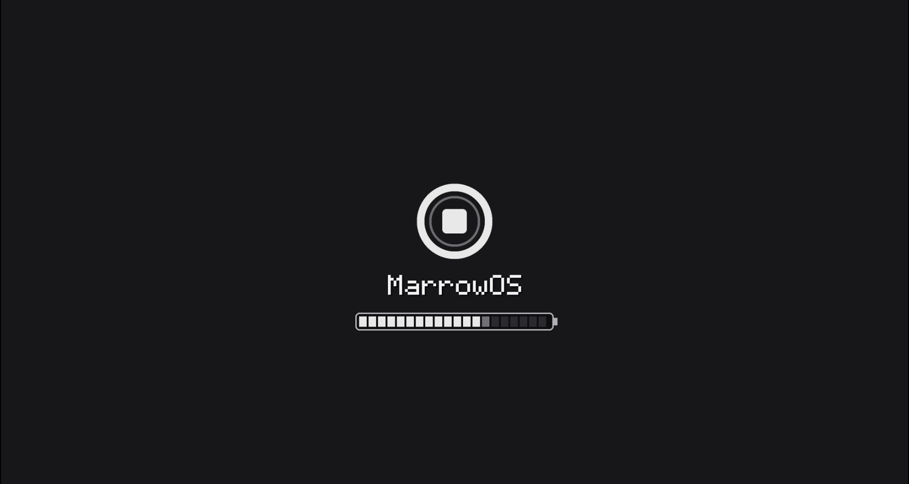
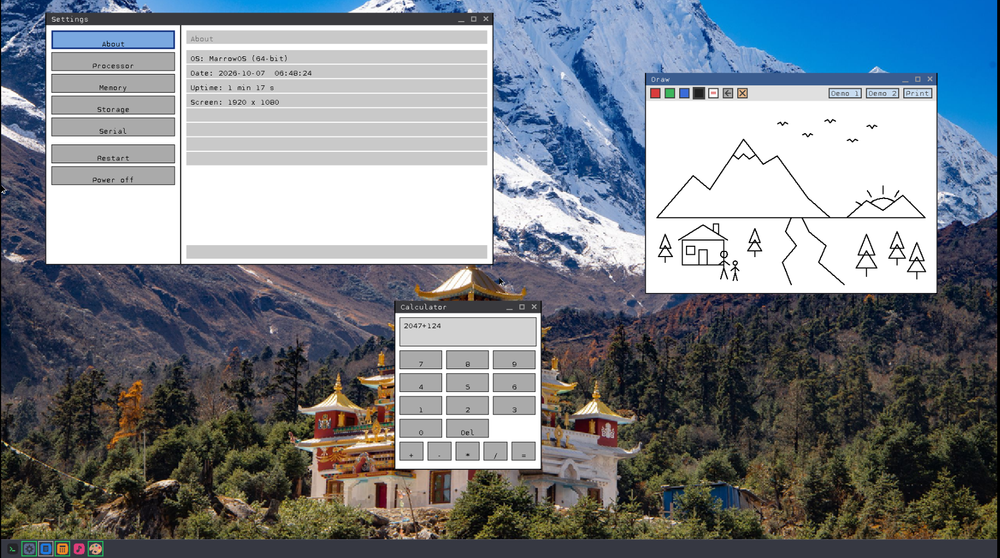
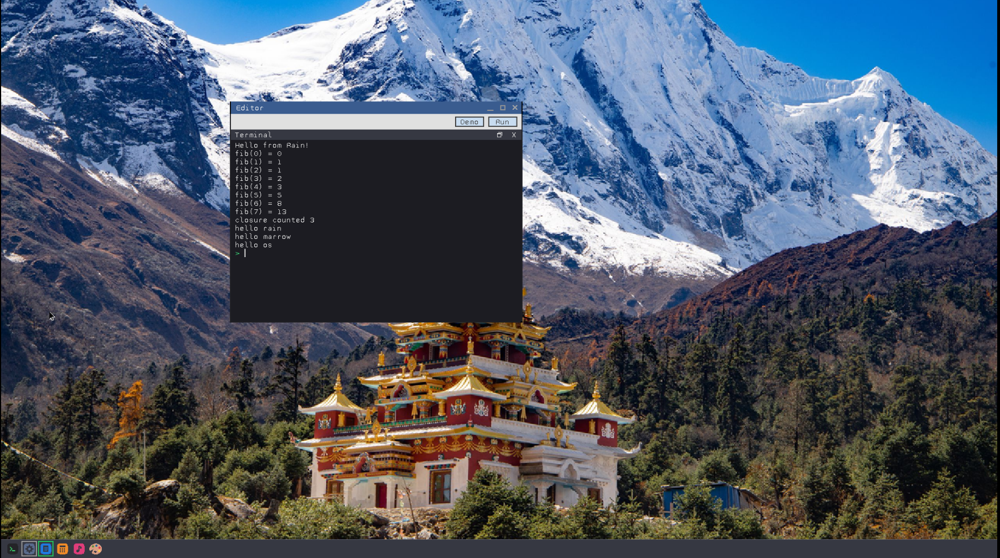
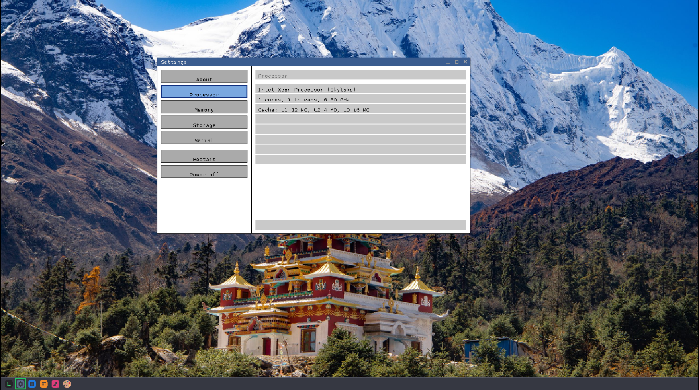

<div align="center">



# MarrowOS

**A 64 bit operating system written from scratch in C and NASM. Own kernel, own window manager, own apps, own programming language.**

</div>

It started as a bootloader and a blinking cursor. Today it boots through UEFI, draws a 1920 x 1080 desktop, runs a mouse driven window manager, loads userland programs off an NVMe drive, and ships with a scripting language I wrote for it called Rain.

No Linux underneath. No libc from somewhere else. No borrowed kernel. Every driver, every syscall, every pixel on that screen is code in this repo. The only thing I did not write is the firmware that hands me the framebuffer.

It is called MarrowOS because marrow is the part you never see but everything depends on.

## Take a look


That is the desktop. Wallpaper, taskbar with app icons, and a cursor that reads real USB input.



Three separate userland processes, each with its own window, all running at once. Settings, Draw and Calculator, every one of them a standalone ELF loaded from disk.



The editor with its built in terminal panel. Hit Demo, hit Run, and the Rain VM prints Fibonacci numbers and closures right there.



Settings reads the CPU through CPUID and tells you what you are actually running on.

## What is in the box

### The kernel

* Boots through **UEFI**. A small custom edk2 application grabs the GOP framebuffer and hands it to the kernel
* **x86_64 long mode** with paging, a GDT and TSS, and an IDT with proper IRQ handling
* Heap allocator, plus a multi heap layer on top of it
* Multitasking with real processes, each loaded from its own ELF
* **Syscalls** through a software interrupt (the isr80h layer), covering windows, events, files, heap, time, serial and system info
* **ELF loader** so userland programs are real ELF binaries, not blobs
* Timekeeping with TSC calibration, plus an RTC for the date and clock
* PCI enumeration, CPUID, and power control for restart and shutdown

### Storage

* **NVMe** driver, which is what the OS actually boots and runs from
* **PATA** driver kept around behind a driver interface, so adding another is a matter of filling in a struct
* GPT partition parsing. The kernel finds its data partition by the FAT volume label MARROW, not by a hardcoded partition number
* **FAT16** filesystem behind a VFS layer with a path parser

### Input

* PS/2 keyboard and mouse
* **xHCI** (USB 3) host controller driver written from the reset sequence up: rings, doorbells, port detection, device enumeration
* **EHCI** (USB 2) support as well
* USB HID keyboard and mouse, including a HID report descriptor parser, so it is not guessing at byte layouts
* I tested the mouse path on real hardware with a mouse I built on an ESP32 S3, and it moved the cursor

### Graphics and the window manager

* Linear framebuffer drawing, BMP image loading with a transparency key color
* Bitmap font rendering
* A compositing window manager with draggable windows, maximize and close buttons, a taskbar, and redraw handling that only repaints what it has to
* Windows are owned by userspace. A program asks the kernel for a window, draws on its own canvas, and gets mouse, keyboard and scroll events back through syscalls
* A kernel terminal and serial output for debugging

### Userland

Everything lives in `programs/` and builds to its own ELF.

* **shell** is the terminal, and it can launch other programs
* **editor** is a text editor with selection, mouse support, scrolling, and an embedded terminal panel that runs Rain code
* **calculator** is a calculator with a proper button grid
* **draw** is a drawing app with colors, undo and an eraser
* **settings** has About, Processor, Memory, Storage and Serial pages, plus Restart and Power off
* **stdlib** is my own small libc: malloc, strings, and the syscall wrappers
* **guilib** is the GUI toolkit that every app above is built on: buttons, labels, panels, fonts, layout
* **containerlib** is a vector container so I stop rewriting growable arrays

## Rain

The editor does not just edit text, it runs it. Rain is a scripting language with a bytecode compiler and a VM, written in C, and it runs inside MarrowOS itself. It has functions, closures, loops, lists, maps, imports and a handful of natives like `toString`, `typeOf` and `clock`.

This is what the Demo button drops into the editor:

```
fun fib(n) {
    if (n < 2) return n;
    return fib(n - 1) + fib(n - 2);
}

for (var i = 0; i < 8; i = i + 1) {
    print "fib(" + toString(i) + ") = " + toString(fib(i));
}

fun counter() {
    var c = 0;
    fun next() {
        c = c + 1;
        return c;
    }
    return next;
}

var tick = counter();
tick();
tick();
print "closure counted " + toString(tick());

var names = #["rain", "marrow", "os"];
for (name von names) {
    print "hello " + name;
}
```

Yes, the loop keyword is `von`. Deal with it.

The VM source sits in `programs/rain/src`, split into the scanner, compiler and VM. There is also a host build in `programs/rain/host_test` so I can run the language on my laptop and test it without booting a whole OS every time.

```
cd programs/rain/host_test
./run_host_tests.sh
```

## Building it

This is a Linux thing for now. The build script makes a raw disk image with loop devices and mounts it, so it needs sudo.

You will need:

* An x86_64 elf cross compiler (gcc and binutils) installed under `~/opt64/cross`, or set `PREFIX` to wherever yours lives
* NASM
* parted, dosfstools, and the usual loop device tooling
* The edk2 source tree cloned into `./edk2`, with `MarrowOS.inf` placed in `MdeModulePkg/Application/MarrowOS`. This folder is gitignored because it is huge
* QEMU, and OVMF at `/usr/share/ovmf/OVMF.fd`

Then:

```
./build.sh
```

That builds the UEFI app, creates a 700 MB GPT disk image at `bin/os.img` with two FAT partitions, builds the kernel and every userland program, and copies things where they belong. The first partition is the ESP holding the bootloader and `kernel.bin`. The second partition, labelled MARROW, holds the apps, images and fonts.

## Running it

```
./run.sh
```

QEMU comes up with a q35 machine, an NVMe drive carrying the image, and an xHCI controller with a USB keyboard and mouse. If you want to poke at the older USB 2 path instead:

```
./runehci.sh
```

## How a boot goes

1. UEFI firmware loads `BOOTX64.efi` from the ESP
2. That app asks the firmware for a framebuffer, loads `kernel.bin`, and jumps in
3. The kernel sets up the GDT, IDT, paging and heaps
4. PCI gets scanned. NVMe, xHCI and friends are brought up
5. The GPT is parsed, the MARROW partition is mounted as FAT16
6. The window manager starts, the wallpaper and taskbar are drawn
7. The shell and apps are loaded from disk as ELF processes

## Repo map

```
src/          the kernel
  idt, gdt    interrupts, segments, TSS
  memory      heap, multiheap, paging
  disk        NVMe, PATA, GPT, streamer
  fs          FAT16, VFS, path parser
  task        processes and tasks
  loader      ELF loader
  isr80h      syscalls
  graphics    windows, terminal, fonts, BMP
  keyboard    PS/2 and USB HID
  mouse       PS/2 and USB HID
  usb         xHCI, EHCI, HID report parser
  io          PCI, TSC, RTC, CPUID, power
programs/     userland
  shell  editor  calculator  draw  settings
  stdlib  guilib  containerlib
  rain        the language
data/images/  wallpaper, icons, cursor, fonts
docs/         screenshots
```

## What is not done yet

Being honest here. There is no networking stack even though QEMU gives it a NIC. There is no sound, even though the taskbar has a music icon sitting there looking hopeful. The filesystem is FAT16 only, there is a single user, and I have only tried it on QEMU and one real machine's USB port. Expect rough edges.

## Why I built it

Because I wanted to know what actually happens between pressing the power button and seeing a cursor move. Reading about it did not cut it. Writing a driver that talks to a USB controller, getting a mouse to move on real hardware after days of staring at ring buffers, was a better teacher than any book.

If you are reading the code to learn, start at `src/kernel.c` and follow the calls down. If you are just here for the screenshots, I get it.

## Author

Built by Yugal.
